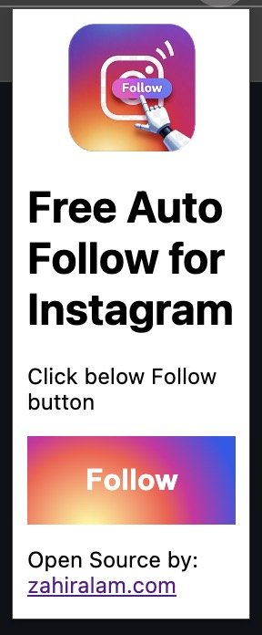

# Free Auto Follow for Instagram

## 🚀 About the Extension

**Free Auto Follow for Instagram** is a browser extension designed to help you grow your Instagram following for free! This extension automates the follow process, increasing your chances of getting followed back.

## 🎯 Features

✅ Automatically follows users on Instagram from the `https://www.instagram.com/explore/people/` page.
✅ Clicks on 10 "Follow" buttons at a time until all users on the page are followed.
✅ Automatically refreshes the page once everyone has been followed.
✅ Displays status messages in the popup to inform users about actions and progress.
✅ Simple and user-friendly interface.
✅ Open-source and free to use!

## 📌 Installation

1. **Download the Extension**
   - Clone this repository 
   ```sh
   git clone https://github.com/mesepith/insta-reach.git
   ```

2. **Load the Extension in Chrome**
   - Open **Google Chrome** and go to `chrome://extensions/`
   - Enable **Developer Mode** (toggle switch at the top right)
   - Click on **Load Unpacked**
   - Select the folder where you downloaded/extracted the extension

3. **Start Using the Extension**
   - Open Instagram and visit: [`https://www.instagram.com/explore/people/`](https://www.instagram.com/explore/people/)
   - Click the **Follow** button in the extension.
   - It will automatically follow users in batches of 10 and refresh the page once everyone is followed.

## 🛠 How It Works

1. The extension checks if you are on `https://www.instagram.com/explore/people/`.
2. If not, it prompts you to visit the correct page.
3. Once on the page, clicking the **Follow** button in the extension will:
   - Click on 10 "Follow" buttons one by one.
   - Repeat the process until all users on the page are followed.
   - Show a message: `You have followed everyone on this page. Refreshing the page...`.
   - Refresh the page with a new list of users to follow.
4. The user can then click the **Follow** button in the extension again to repeat the process.

## 📢 Status Messages
The extension provides real-time status messages in the popup:

- **If the user is on the wrong page:**
  - "Visit this link: [Instagram Explore People](https://www.instagram.com/explore/people/) and then click on the Follow button above."
- **During follow process:**
  - "X people followed."
  - "Follow limit of 10 reached."
- **If all users on the page are followed:**
  - "You have followed everyone on this page. Refreshing the page..."

## 📷 Screenshots



## 📜 Permissions

This extension requires the following permissions:
- `activeTab`: To interact with Instagram pages.
- `storage`: To store and display status messages in the popup.
- `scripting`: To execute JavaScript and automate clicks.

## 📖 Contributing

We welcome contributions! Follow these steps:

1. Fork the repository.
2. Create a new branch: `git checkout -b feature-name`
3. Commit your changes: `git commit -m 'Add new feature'`
4. Push to your branch: `git push origin feature-name`
5. Open a Pull Request.

## 📬 Contact

For any questions or feedback, open an issue or reach out via [Twitter handle ZahirCodeCraft].
